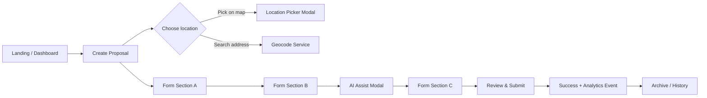
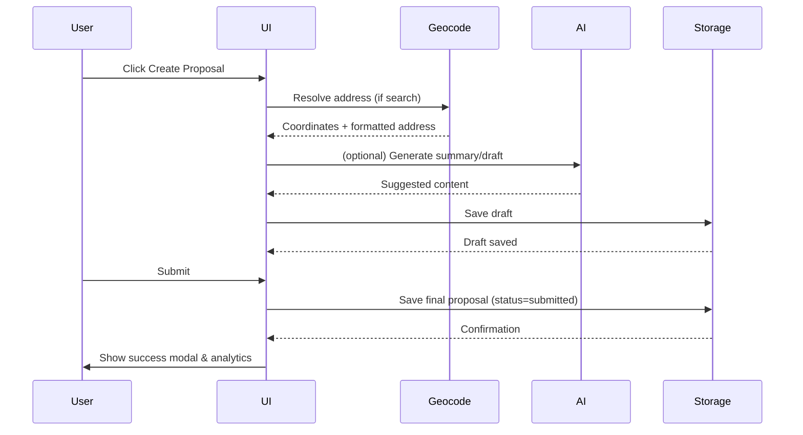
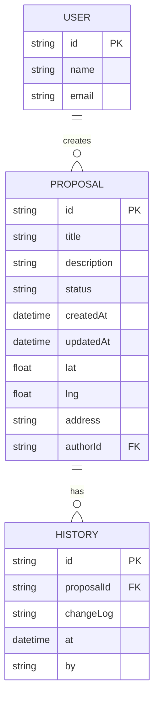
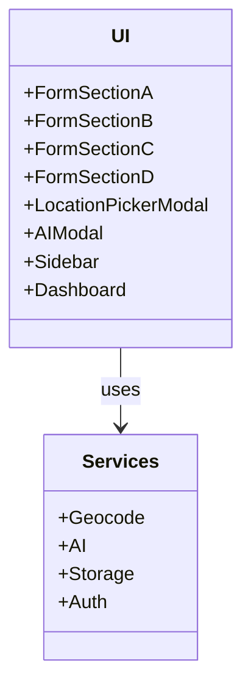
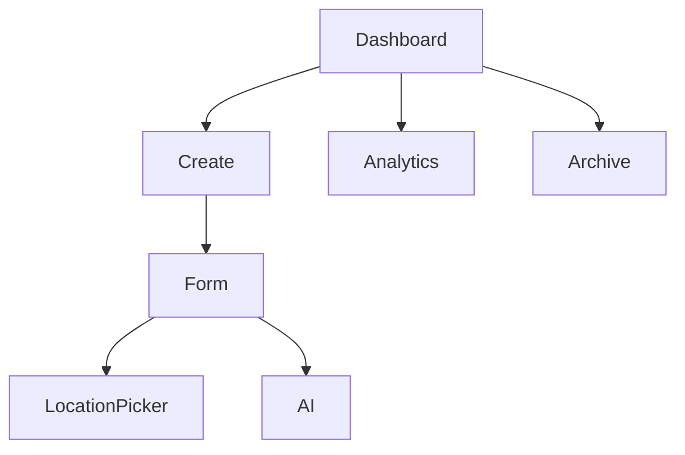

# Dude — Product Requirements Document (PRD)

> Dude web application — proposal management, location-aware submissions, AI-assisted drafting, and analytics.

---

## Table of Contents

- Overview
- Goals & Success Metrics
- Target Audience & Personas
- Product Scope & Feature Summary
- User Flows (Mermaid)
- System Architecture (Mermaid)
- Component Interaction & Sequences (Mermaid)
- Data Model (Mermaid ERD)
- API & Data Schema
- UX & Visual Guidelines
- Non-functional Requirements
- Rollout & Roadmap
- Risks & Mitigations
- Acceptance Criteria
- Appendix

---

## Overview

Dude is a lightweight web application for creating, managing, and analyzing proposals tied to locations. It combines fast form workflows, AI-assisted drafting, geocoding, and a dashboard for analytics and archival.

Vision: Empower people to submit high-quality, geo-aware proposals quickly and gain actionable insights from submissions.

Core product pillars:
- Fast proposal creation with progressive form sections
- Location picking + accurate geocoding
- AI-assisted content generation & summarization
- Rich dashboard & analytics
- Secure, searchable archival

---

## Goals & Success Metrics

- Time-to-submit: median < 3 minutes for first-time users
- Draft-to-submission conversion rate: > 70%
- User satisfaction (NPS/feedback) > 8/10
- Active users: 10k monthly within 12 months of launch
- Proposal acceptance rate (if integrated with external review systems): improve by 15% after AI-assist

---

## Target Audience & Personas

- Olivia — Community Organizer
  - Needs: Quick geo-tagged proposals for local initiatives
  - Pain: Long bureaucratic forms

- Raj — Urban Planner
  - Needs: Fast access to geospatial proposal data and analytics
  - Pain: Incomplete location metadata

- Maya — Volunteer Contributor
  - Needs: Help drafting compelling descriptions
  - Pain: Unsure about language and structure

---

## Product Scope & Feature Summary

MVP features (in scope):
- Multi-section proposal form (FormSectionA..D)
- Location picker modal with map and address search
- AI-assisted content helper modal
- Proposal list, detail modal, history, and archive view
- Dashboard with analytics and proposal cards
- Persistent storage and local sync

Future / out-of-scope for MVP:
- Multi-tenant / enterprise billing
- Real-time collaboration (live editing)
- External review workflow integrations (post-MVP)

---

## User Flows

### High-level user flow



Description: Users start at Dashboard -> create a proposal -> choose or search location -> fill progressive form sections -> optionally use AI -> review and submit -> view analytics and archive.

---

## System Architecture

### Architecture overview

```mermaid
graph LR
  subgraph Client
    A[React + Vite App]
    A --> UI[Components]
  end

  subgraph Backend (BaaS / Serverless)
    B[Storage / DB]
    C[Geocode / Map API]
    D[AI Service]
    E[Auth]
  end

  UI -->|read/write| B
  UI -->|geocode requests| C
  UI -->|AI prompts| D
  UI -->|login| E
```

Notes: The app is primarily client-side (Vite + React) with backend integrations for persistent storage (could be serverless DB or hosted API), geocoding third-party API, and AI provider.

---

## Component Interaction & Sequences

### Sequence: Create & Submit Proposal



---

## Data Model (ERD)



---

## API & Data Schema

Minimal frontend-facing endpoints (MVP-ready — can be BaaS SDK calls):

- GET /proposals -> list proposals
- POST /proposals -> create proposal
- GET /proposals/:id -> fetch details
- PATCH /proposals/:id -> update proposal (e.g., publish, archive)
- GET /geocode?query= -> map/geocoding service proxy
- POST /ai/suggest -> AI assist (rate-limited)

Request/response examples (abridged):

POST /proposals
{
  "title":"...",
  "description":"...",
  "lat": 37.77,
  "lng": -122.41,
  "address":"...",
  "authorId":"user_123"
}

Response: 201 + created object

---

## UX & Visual Guidelines

- Clean, spacious layout; soft rounded cards (see `components/ui/*`)
- Primary action color: use a single vibrant accent for CTAs
- Progressive disclosure for form sections to reduce cognitive load
- Modal patterns: central, focus-trap, keyboard accessible
- Accessibility: color contrast >= 4.5:1, keyboard navigation, ARIA labels for maps & inputs

Design tokens: (example)
- Spacing scale: 4,8,12,16,24,32
- Border radius: 8px
- Font stack: system-ui, Inter, -apple-system, "Segoe UI"

---

## Non-functional Requirements

- Performance: First meaningful paint <= 1s on 3G simulated throttling
- Scalability: Backend should handle 10k daily active users; storage auto-scale
- Security: Data-at-rest encryption; minimal PII stored; XSS/CSRF mitigations
- Privacy: Geolocation stored only with explicit user consent; retention policy
- Reliability: 99.9% uptime SLA for core API

---

## Rollout & Roadmap

Phase 0 (Week 0-2): Core form + location picker + storage
Phase 1 (Week 3-6): AI assist, modals, history & archive
Phase 2 (Week 7-10): Dashboard analytics, export, search
Phase 3 (Post-MVP): Integrations, team accounts, advanced analytics

Milestones and acceptance criteria are documented in the Acceptance Criteria section.

---

## Risks & Mitigations

- Risk: AI suggestions produce incorrect or biased content
  - Mitigation: Provide clear disclaimers, human review step, content filters
- Risk: Geocoding inaccuracies
  - Mitigation: Allow manual pin adjustment; support multiple geocode providers
- Risk: Privacy complaints from location data
  - Mitigation: Consent flow; allow users to opt-out of storing precise coords

---

## Acceptance Criteria

- Users can create and submit a proposal with a valid location and see it in the dashboard
- AI-assist suggests content within 5s and is optional
- Drafts auto-save reliably and can be resumed
- Dashboard shows at least 3 useful analytics: proposals per area, status distribution, timeline
- All core UI components are accessible and keyboard-navigable

---

## Appendix

- File references: UI implementation in `src/components` — `FormSectionA..D`, `LocationPickerModal`, `AIModal`, `Dashboard` and `ProposalCard`.
- Important libs: Vite, React, third-party geocode & AI provider SDKs.

---

## Visuals (Extra diagrams)

### Component topology



### Sitemap



---

Thank you — this PRD is intended to serve as the canonical product document for initial development and subsequent design/engineering conversations. Add comments or requested edits as pull request feedback in `docs/PRD.md`.
